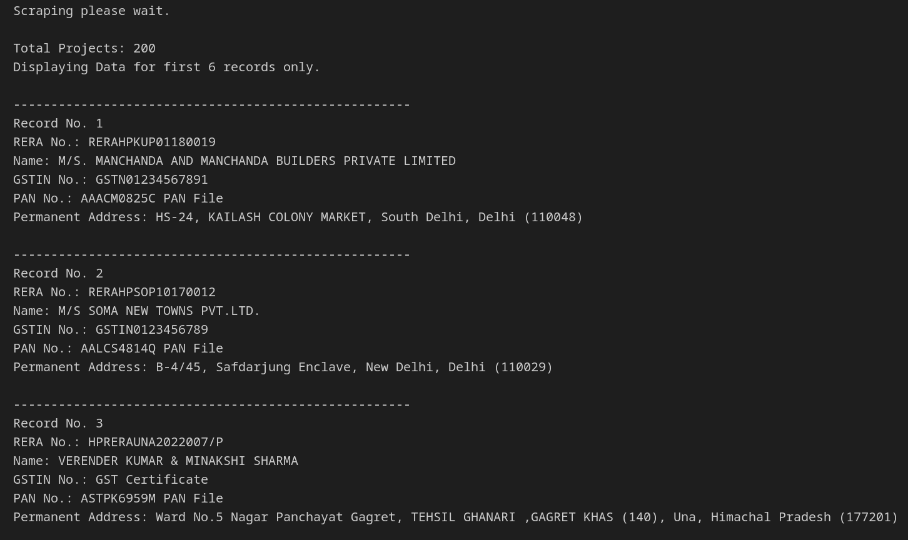
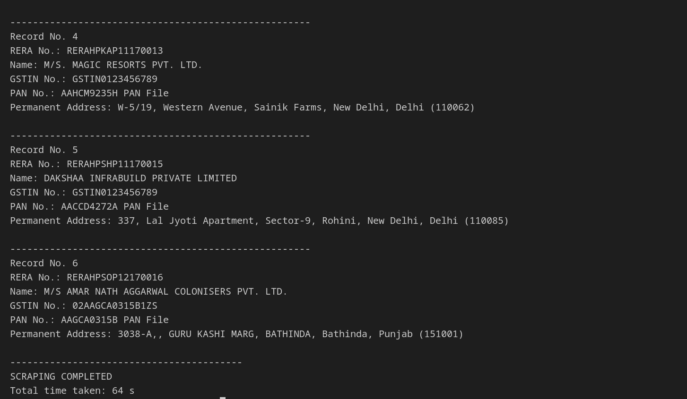

# HPRERA Data Scraper

This Python project scrapes data from the [Himachal Real Estate Regulatory Authority (HRERA) Public Dashboard](https://hprera.nic.in/PublicDashboard/). The script extracts information from the first 6 projects listed under the "Registered Projects" heading. The details collected include:

- GSTIN No
- PAN No
- Name
- Permanent Address

## Screenshot
   
   


## Requirements

- Python 3.x
- Chrome WebDriver compatible with your Chrome version (Linux version 126.0.6478.182 (Official Build) (64-bit) is used in this project)

To run this script on a different OS or Chrome version, download the appropriate ChromeDriver from [ChromeDriver Downloads](https://developer.chrome.com/docs/chromedriver/downloads).

## Setup

1. **Clone the repository**:
   ```sh
   git clone https://github.com/dhimanparas20/RERA-Project-Scraper
   cd RERA-Project-Scraper
   ```

2. **Install Dependencies**
    ```sh
    pip3 install -r requirements.txt
    ```

3. **Run The Script**
    ```sh
    python3 scrape.py
    ```

## Notes
- Ensure you have the correct ChromeDriver version matching your installed Chrome version.
If you encounter any issues related to the WebDriver or Chrome version, download the appropriate version from ChromeDriver Downloads.

- increase the `wait_timeout` inside `scrape.py` `line 16` if getting timeout error.

## License
 - This project is licensed under the [MIT License](https://opensource.org/license/mit). See the [LICENSE](LICENSE) file for details.